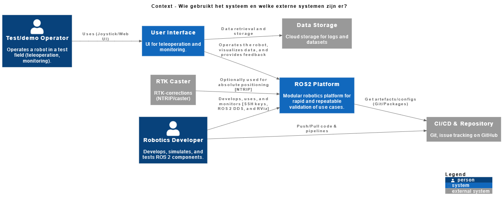
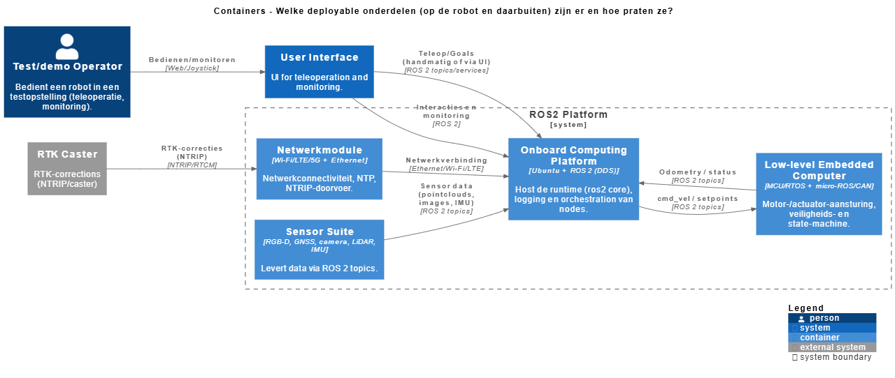
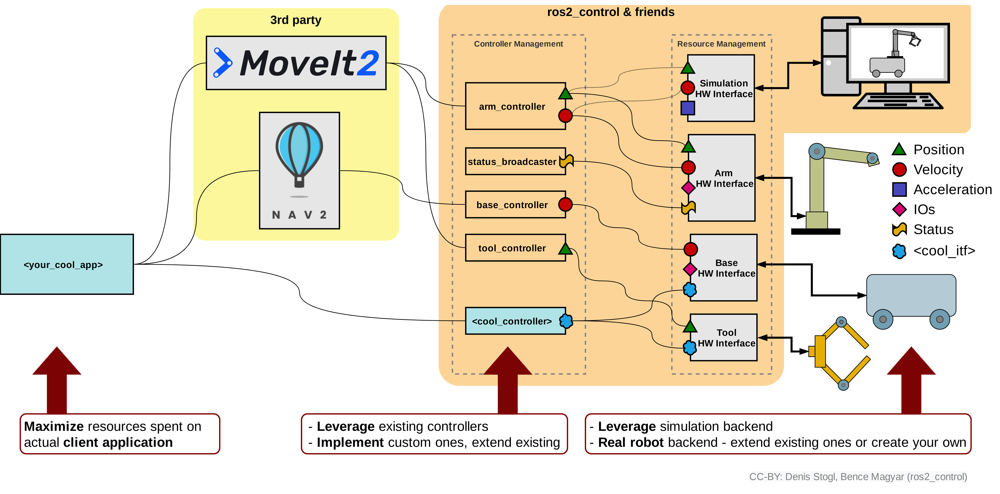
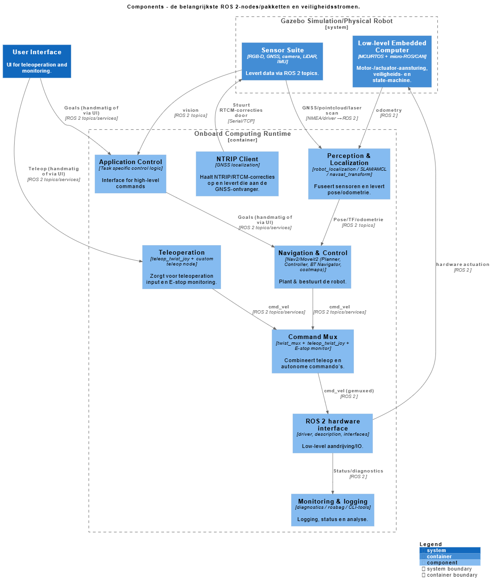

# ROS 2 Platform Architecture Documentation

This document explains the system architecture using **C4-PlantUML** diagrams. The diagrams are rendered as PNG images and provide three levels of abstraction:

1. **Context diagram** – who uses the system and which external systems interact with it
2. **Container diagram** – deployable building blocks and their communication
3. **Component diagram** – key ROS 2 nodes and runtime responsibilities

---

## 1. System Context Diagram

### Purpose
The context diagram answers the question:
> *Who uses the system, and which external systems does it interact with?*

### Explanation
- **Test/demo Operator**  
  Operates the robot in a test field using a joystick or web-based UI. Typical tasks include teleoperation and live monitoring.

- **Robotics Developer**  
  Develops, simulates, and tests ROS 2 components. Interacts with the platform using SSH, DDS-based ROS 2 communication, and tools such as RViz.

- **User Interface (UI)**  
  Provides teleoperation, visualization, and feedback to the operator and developer. This can in cases of development also be Rviz.

- **ROS 2 Platform**  
  The core robotics platform. It hosts modular ROS 2 components to enable rapid and repeatable validation of robotic use cases.

- **CI/CD & Repository (GitHub)**  
  Used for source control, issues, and automated pipelines. The platform pulls artifacts and configuration from here.

- **RTK Caster**  
  Optional external service providing GNSS RTK corrections via NTRIP for absolute positioning.

- **Data Storage**  
  Optional external service providing storage for logs and retrieval of data to be used for task specification.

---

## 2. Container Diagram

### Purpose
The container diagram shows:
> *Which deployable parts exist (on the robot and externally), and how they communicate.*

### Containers inside the ROS 2 Platform

- **Netwerkmodule**  
  Provides Wi‑Fi/LTE/5G/Ethernet connectivity, NTP time sync, and routes NTRIP traffic.

- **Onboard Computing Platform**  
  An Ubuntu-based computer running ROS 2 (DDS). This container hosts the runtime, logging, orchestration, and the majority of ROS 2 nodes.

- **Low-level Embedded Computer**  
  MCU/RTOS system using micro‑ROS or CAN. Responsible for motor control, actuator handling, safety logic, and state machines.

- **Sensor Suite**  
  Includes RGB‑D cameras, GNSS, LiDAR, IMU, and other sensors providing data via ROS 2 topics.

### Key Interactions

- Sensors publish data (images, point clouds, IMU) to the onboard computer via ROS 2 topics.
- The UI sends teleoperation commands and goals to the onboard computer.
- The onboard computer communicates motion commands to the low-level controller and receives odometry/status feedback.
- The RTK caster sends GNSS correction data through the network module.

---

## 3. Component Diagram (Onboard Computing Runtime)
The onboard computing runtime is an Ubuntu-based computer running ROS 2 (DDS). This container hosts the runtime, logging, orchestration, and the majority of ROS 2 nodes. This follows the design of ROS2 Control. It runs NAV2 and/or MoveIt2 for movement planning of mobile vehicles and robotic arms, the controllers which calculate the action to take from the planned commands and the hardware interfaces for actuation of the hardware.

### Purpose
This diagram zooms into the onboard computer and describes:
> *The main ROS 2 nodes/packages and safety- and data-flows between them.*

### Main Components

- **Application Control**  
  Custom package that uses perception of the robot and high level user goals to create actionable goals for navigation & control.

- **Perception & Localization**  
  Uses packages such as `robot_localization`, `SLAM`, `AMCL`, and `navsat_transform` to fuse sensor data and estimate the robot pose.

- **Teleop & Command Mux**  
  Combines manual teleoperation, autonomous commands, and emergency stop logic using tools like `twist_mux`.

- **Navigation & Control**  
  Based on `Nav2`/`MoveIt2`. Handles path planning, behavior trees, control loops, and costmaps.

- **ROS 2 Hardware Interface**  
  Bridges high-level commands to the low-level embedded computer and exposes hardware state back to ROS 2.

- **Monitoring & Logging**  
  Diagnostics, rosbag recording, and CLI tools for debugging and analysis.

- **NTRIP Client**  
  Retrieves RTCM correction data from the RTK caster and forwards it to the GNSS receiver.

### Data Flow Summary

- UI sends goals and teleop commands → mux/navigation nodes.
- Navigation and mux output velocity commands → hardware interface.
- Low-level computer executes commands and returns odometry and status.
- Sensor data feeds perception and localization, which in turn provides pose and transforms to navigation.
