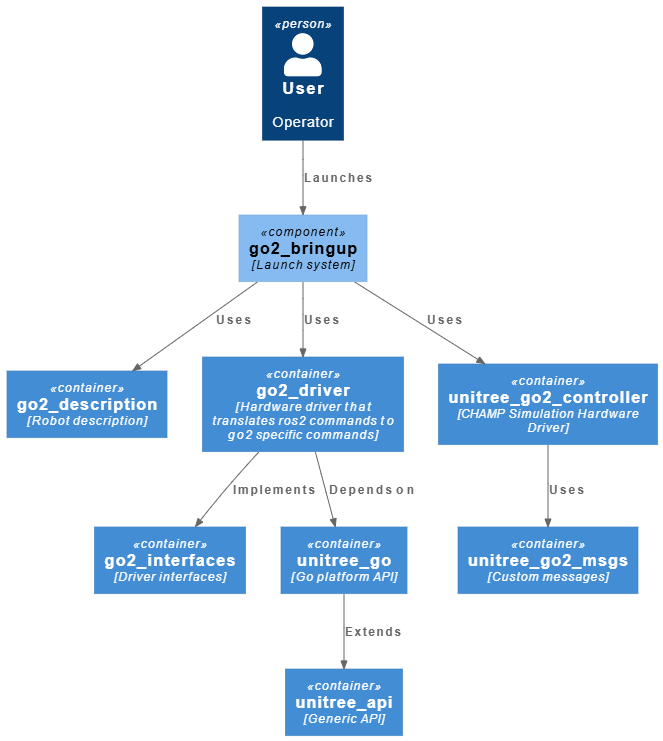

# Enexis GO2

## Packages

- go2_bringup : launches the go2 system
- go2_description : go2 description package
- go2_driver : go2 hardware driver
- go2_interfaces : interface for go2_driver
- unitree_api : generic unitree api dependency
- unitree_go : unitree api dependency for unitree go platforms
- unitree_go2_controller : champ controller for gazebo simulation
- unitree_go2_msgs : custom messages for unitree_go2_controller package

## Architecture

## Resources

go2_description is an altered version of the [official go2_description](https://github.com/unitreerobotics/unitree_ros/tree/master/robots/go2_description)

go2_driver and its dependencies (go_interfaces, unitree_api and unitree_go) are taken from [the Rey Juan Carlos University robotics lab github](https://github.com/orgs/Unitree-Go2-Robot/repositories). unitree_api and unitree_go are however copies of the folders found in an [official unitree package](https://github.com/unitreerobotics/unitree_ros2/tree/master)

unitree_go2 controller and unitree_go2_msgs are made by Sogeti Labs Robotics. They adapted the Open Source CHAMP quadrupedal locomotion controller to function with the Go2 in a Gazebo simulation.
